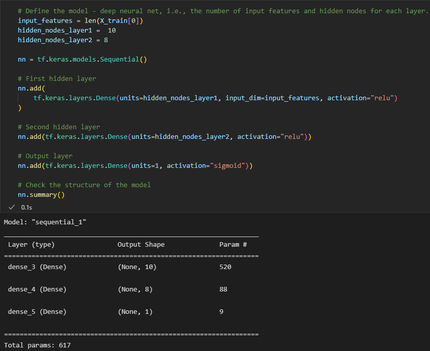
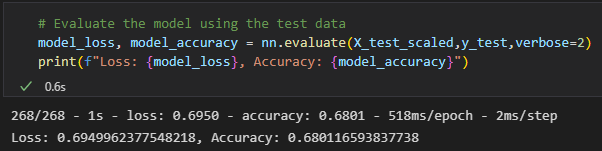

# Neural_Network_Charity_Analysis

# Overview of Project

The purpose of this project is to use deep-learning neural networks with the TensorFlow platform in Python, to analyze  whether applicants will be successful if funded by Alphabet Soup. For this analysis we had a dataset containing various measures on 34,299 organizations that have been funded by Alphabet Soup. This project compromised of the 3 deliverables:

- Preprocessing the data for the neural network

- Compile, Train and Evaluate the Model

- Optimizing the model

## Resources

- Dataset charity_data.csv

- Languages: Python

- Libraries: Scikit-learn, TensorFlow, Pandas

# Results:

## Data Preprocessing

- EIN and NAME columns are droppped since they are identification information

- IS_SUCCESSFUL contains binary data refering to weither or not the charity donation was used effectively. This variable is then considered as the target for our deep learning neural network.

- APPLICATION_TYPE, AFFILIATION, CLASSIFICATION, USE_CASE, ORGANIZATION, STATUS, INCOME_AMT, SPECIAL_CONSIDERATIONS, ASK_AMT are the features for our model.

## Compiling, Training, and Evaluating the Model

- The Model was trained on 100 epochs. We tried different epoch settings and the models did made significant continuous improvements as you can see in the results below.

- Adam Optimizer which uses a gradient descent approach to ensure that the algorithm will not get stuck on weaker classifying variables and features and to enhance the performance of classification neural network was used.

- Two hidden layers were used. One had 10 neurons and the otherhad 8.They both have the "relu" activation fuction. The activationfunction for the outputlayer is "sigmoid". Below is the code as well as the output.

## Summary

The model ended up with the accuracy score of 68% after optimization.More features could be removed or added to the dataset to increase accuracy.Additionaly, a supervised machine learning model such as the Random Forest Classifier to combine a multitude of decision trees to generate a classified output and evaluate its performance against our deep learning model.
